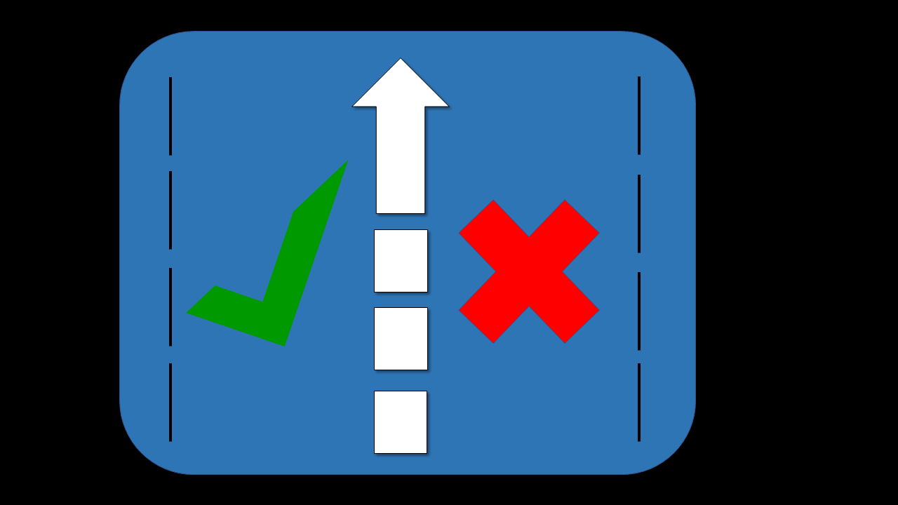
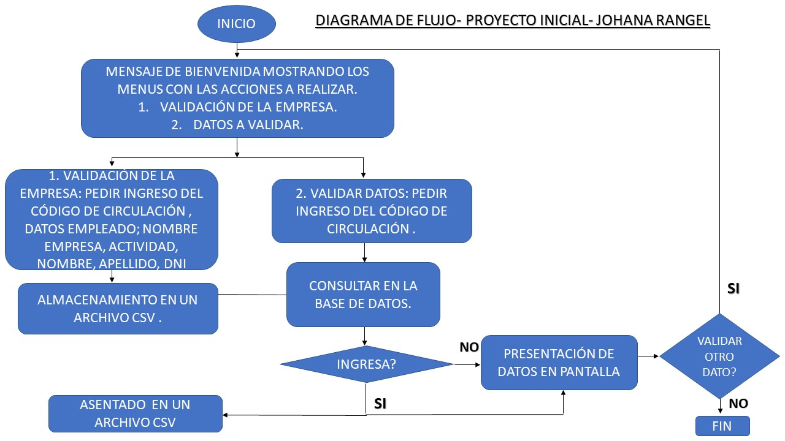

Autor: Johana Rangel
johanarang@hotmail.com\

# proyecto_programador_python
Primer proyecto integrador.

# Título del proyecto.
Verificación de permisos de circulación provincial.

# Descripción. 
Es un programa que permite la verificación de perimisos de circulación para el ingreso a provincia. 
Está realizado con el lenguaje de programación Python. Funciona con un menu que tiene tres acciones a realizar:

# Acción 1: 
*Validación de la empresa*.
Donde se debe crear un usuario para poder completar el formulario  de datos del empleado, empresa, la actividad, también los datos del empleado; nombre, apellido, fecha de permiso, edad, DNI y código de circulación obtenido (información almacenada en una base de datos)

# Acción 2: 
*Validar datos* (este dato será el código de circulación emitido por la provincia de destino), luego el proceso consiste en verificar en la base de datos anterior, si ingresa o no, mostrando por pantalla la información. En caso ingrese, la información queda asentada en una segunda base de datos.

# Acción 3: 
salir del programa

# Diagrama de flujo.

# Ejemplo de una función aplicada en el programa.

def procesar():
    
    '''Función creada para tomar los datos del formulario completado por el usuario, para hacer un POST y así evaluar si cumplen con las condiciones que se establecen o no, en el primer caso, se inserta en la base de datos llamada validacion, proceso que se hace a través de la importación del módulo empresa_valida y la función insert(), en caso contrario se informa del error que pueda surgir a través de un archivo html. 
    Luego se arma un diccionario llamado datos con los ingresos accesibles para pasarlos a un archivo html y así mostrarlos en un tabla la información ingresada por el usuario.
    '''
         
    @app.route('/procesar', methods=['POST'])
    def procesar():
    
    if request.method == 'POST':
        try:
            # Obtener del HTTP POST JSON de los datos registrados por la empresa
            codigo = str(request.form.get('codigo'))
            empresa= str(request.form.get('empresa')).upper()
            actividad = str(request.form.get('actividad')).upper()
            nombre = str(request.form.get('nombre')).upper()
            dni = str(request.form.get('dni'))
            edad = str(request.form.get('edad')) 
            fecha_permiso = datetime.now().strftime("%Y-%m-%d %H:%M:%S.%f")
            riesgo = str(request.form.get('riesgo')).upper() 
 

            if(codigo is None or codigo.isdigit() is False or
                empresa is None or empresa.isdigit() is True or
                actividad is None or actividad.isdigit() is True or 
                nombre is None or nombre.isdigit() is True or
                riesgo is None or riesgo.isdigit() is True or
                edad is None or edad.isdigit() is False or
                dni is None or dni.isdigit() is False):
                # Datos ingresados incorrectos
                return render_template('error_ingreso.html')

            else:
                #Completando la BD con los datos del HTTP.
                empresa_valida.insert(int(codigo), empresa, actividad, nombre, int(edad), int(dni), fecha_permiso, riesgo)
                
                #Se arma diccionario para pasar al archivo html.
                datos = {"codigo":codigo, "empresa":empresa, "actividad":actividad, "nombre":nombre,
                        "edad":edad, "dni":dni, "fecha_permiso":fecha_permiso, "riesgo":riesgo}

                #Se informa a través de un archivo html en formato tabla los datos ingresados.        
                return render_template('procesado.html', datos=datos)

        except:
            return jsonify({'trace': traceback.format_exc()})
    
# Muchas gracias!
Cualquier duda o sugerencia pueden contartarse con Johana Rangel al mail johanarang@hotmail.com 

# Fecha de última actualización.
17 de noviembre 2020

